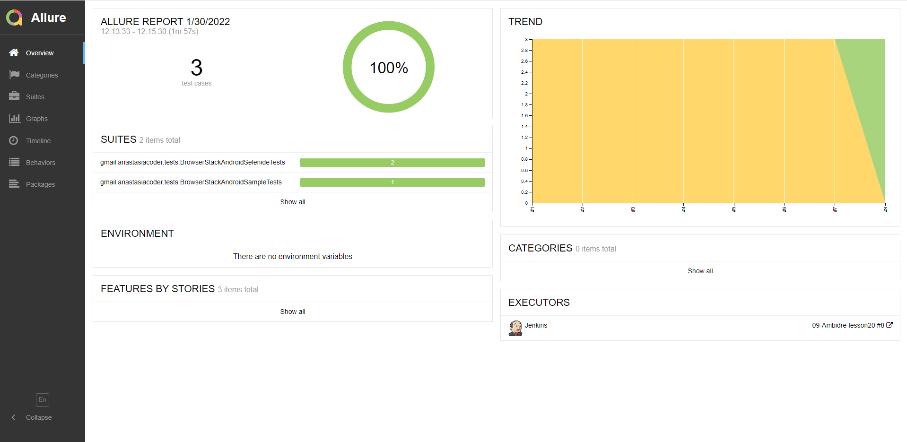
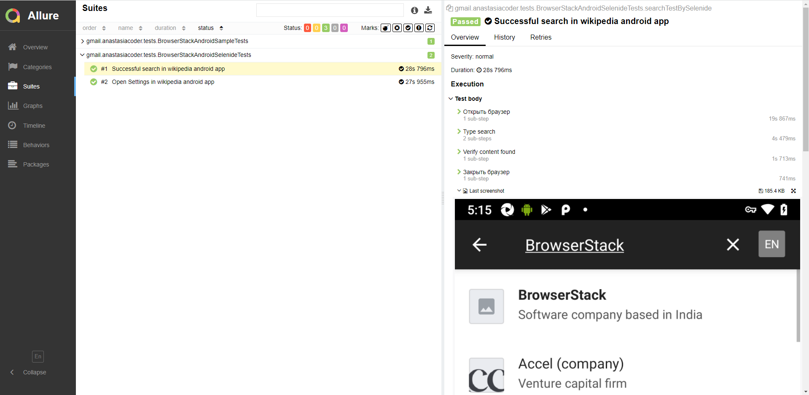
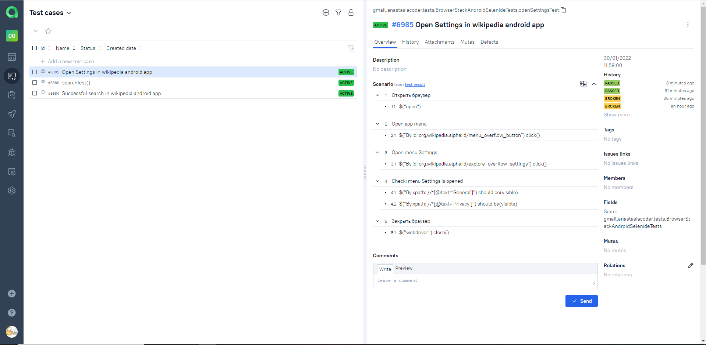
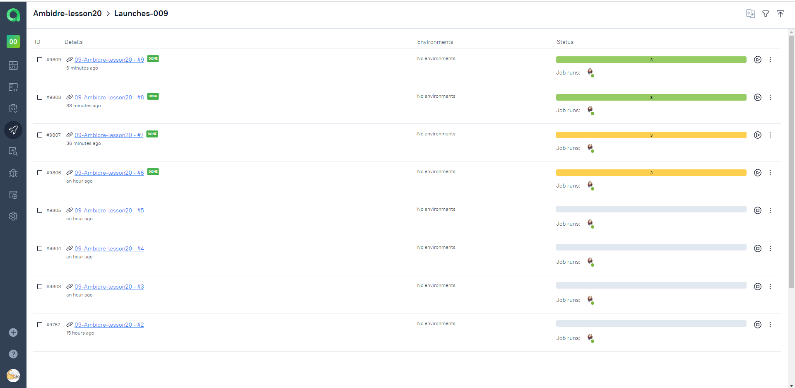
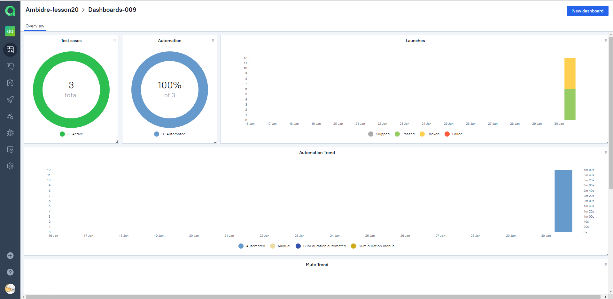
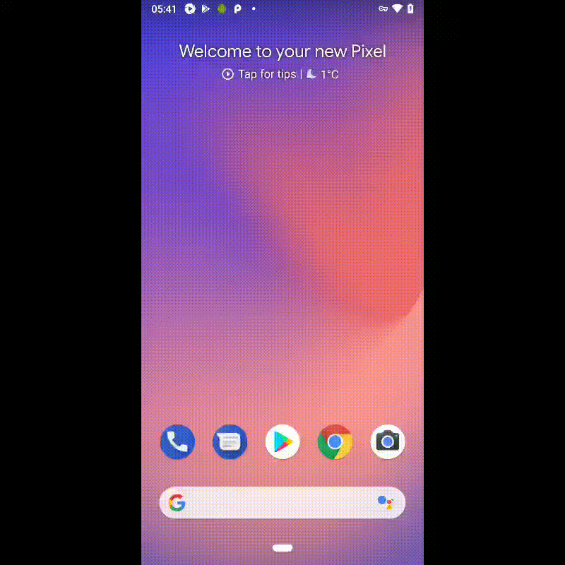

# Задание 20. Примеры UI автотестов для Android приложения Wikipedia (trial сайта https://browserstack.com)

## Покрытый функционал
> Разработаны автотесты на <code>UI</code>.

### UI
- [x] Отображение результатов поиска
- [x] Проверка открытия Settings

## Технологический стек

### Для запусков автотестов используется Jenkins.

##### Примеры готовых сборок можно посмотреть [по ссылке](https://jenkins.autotests.cloud/job/09-Ambidre-lesson20/)

### Анализ результатов запусков в Jenkins через Allure Reports

### Для отображения результатов сборок также используется Allure TestOps.

##### Примеры запусков и их результаты можно посмотреть [по ссылке](https://allure.autotests.cloud/project/939/dashboards)

### Пример списка тестов и их прохождения в Allure TestOps

### Результаты запусков Launches в Allure TestOps

### Основной Dashboards

### Пример запуска теста в BrowserStack

